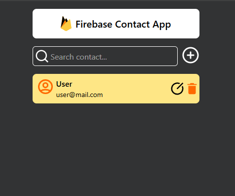

# React Firebase CRUD App

A simple contact manager built with **React** and **Firebase Firestore**, enabling real-time Create, Read, Update, and Delete operations. Styled with **Tailwind CSS** and powered by **React Toastify** for interactive feedback.

---

## 📸 Screenshot



---

## ⚙️ Tech Stack

- React
- Firebase Firestore
- Tailwind CSS
- React Toastify
- Formik
- Vite

---

## 🚀 Getting Started

Clone the repository and install dependencies:

```
git clone https://github.com/imamulkadir/React_crudFirebase.git
cd React_crudFirebase
npm install
npm run dev
```

---

## 📁 Project Structure

```
src/
├── components/
│   ├── AddAndUpdateContact.jsx   # Modal form for add/update
│   ├── ContactList.jsx           # Contact rendering and search
│   └── Modal.jsx                 # Reusable modal component
├── firebaseConfig.js             # Firebase config and initialization
├── App.jsx                       # Main app component
└── main.jsx                      # Vite entry point
```

---

## 🔥 Firebase Setup

1. Go to [Firebase Console](https://console.firebase.google.com/) and create a new project.
2. Enable Firestore under “Build” > “Firestore Database”.
3. Copy your config and paste it into `firebaseConfig.js`.

```
import { initializeApp } from "firebase/app";
import { getFirestore } from "firebase/firestore";

const firebaseConfig = {
  apiKey: "YOUR_API_KEY",
  authDomain: "YOUR_PROJECT_ID.firebaseapp.com",
  projectId: "YOUR_PROJECT_ID",
  storageBucket: "YOUR_PROJECT_ID.appspot.com",
  messagingSenderId: "YOUR_SENDER_ID",
  appId: "YOUR_APP_ID"
};

const app = initializeApp(firebaseConfig);
export const db = getFirestore(app);
```

---

## ✨ Features

- 🔄 Real-time contact updates from Firestore
- 📬 Add, update, and delete contacts
- 🔍 Filter contacts by name and email
- 🔔 Funny toast notifications
- 💻 Responsive UI with modals

---

## 🔎 Filtering Logic

```
const filteredContacts = contacts.filter((contact) =>
  contact.name.toLowerCase().includes(searchQuery.toLowerCase()) ||
  contact.email.toLowerCase().includes(searchQuery.toLowerCase())
);
```

---

## 😂 Toast Messages

Creative toast feedback:

- `"Another one. Yep. Added 😒"`
- `"PATCH request successful 🔧"`
- `"Contact yeeted out of the database 🚮"`

---

## 🧠 Future Ideas

- Firebase Authentication
- Pagination
- Dark mode toggle
- Firebase Hosting deployment

---

## 📜 License

MIT © [Imamul Kadir](https://github.com/imamulkadir)

---

## 🤝 Contributions

Pull requests are welcome! For major changes, open an issue first to discuss.
